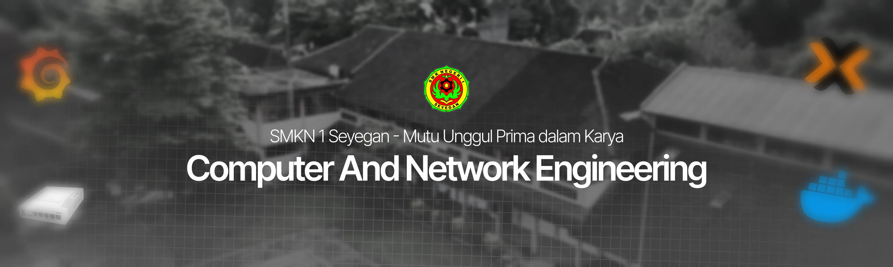

## Hey, it's us, we are TKJ Skanesga! 👋

We are a collaborative platform between students and teachers to develop technology and software solutions that we use at school!

### 🏫 About Our Program

This school offers several majors, including our major: Computer and Network Engineering. Our main goal is to produce reliable network implementations with **Mikrotik** devices and manage computer and server systems.

🐧 [See more](https://smkn1seyegan.sch.id/) on our official website
